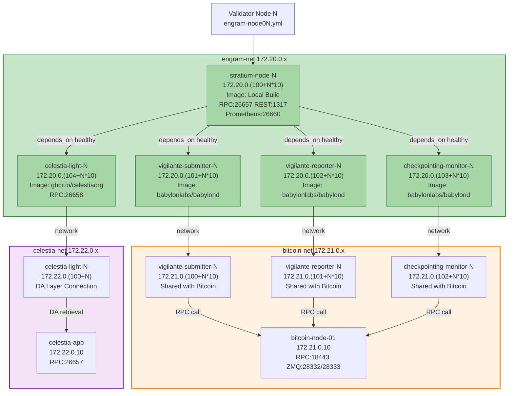

# Stratium Infrastructure Architecture

## Network Topology

### High-Level Architecture (Mermaid Diagram)

```mermaid
graph TB
    subgraph EngHost["🐳 Docker Host"]
        subgraph EngNet["🌐 engram-net (172.20.0.0/24)"]
            Prom["📊 Prometheus<br/>172.20.0.20:9090"]
            Grafana["📈 Grafana<br/>172.20.0.21:3000"]
            
            subgraph Val0["⚙️ Validator Node 0"]
                SN0["stratium-node-0<br/>172.20.0.100<br/>RPC:26657 REST:1317"]
                VS0["vigilante-submitter-0<br/>172.20.0.101"]
                VR0["vigilante-reporter-0<br/>172.20.0.102"]
                VM0["checkpointing-monitor-0<br/>172.20.0.103"]
                CL0["celestia-light-0<br/>172.20.0.104<br/>RPC:26658"]
            end
            
            subgraph Val1["⚙️ Validator Node 1"]
                SN1["stratium-node-1<br/>172.20.0.110<br/>RPC:26757 REST:1417"]
                VS1["vigilante-submitter-1<br/>172.20.0.111"]
                VR1["vigilante-reporter-1<br/>172.20.0.112"]
                VM1["checkpointing-monitor-1<br/>172.20.0.113"]
                CL1["celestia-light-1<br/>172.20.0.114<br/>RPC:26758"]
            end
            
            subgraph Val2["⚙️ Validator Node 2"]
                SN2["stratium-node-2<br/>172.20.0.120<br/>RPC:26857 REST:1517"]
                VS2["vigilante-submitter-2<br/>172.20.0.121"]
                VR2["vigilante-reporter-2<br/>172.20.0.122"]
                VM2["checkpointing-monitor-2<br/>172.20.0.123"]
                CL2["celestia-light-2<br/>172.20.0.124<br/>RPC:26759"]
            end
            
            subgraph Val3["⚙️ Validator Node 3"]
                SN3["stratium-node-3<br/>172.20.0.130<br/>RPC:26957 REST:1617"]
                VS3["vigilante-submitter-3<br/>172.20.0.131"]
                VR3["vigilante-reporter-3<br/>172.20.0.132"]
                VM3["checkpointing-monitor-3<br/>172.20.0.133"]
                CL3["celestia-light-3<br/>172.20.0.134<br/>RPC:26760"]
            end
            
            SN0 --> VS0
            SN0 --> VR0
            SN0 --> VM0
            SN0 --> CL0
            SN1 --> VS1
            SN1 --> VR1
            SN1 --> VM1
            SN1 --> CL1
            SN2 --> VS2
            SN2 --> VR2
            SN2 --> VM2
            SN2 --> CL2
            SN3 --> VS3
            SN3 --> VR3
            SN3 --> VM3
            SN3 --> CL3
        end
        
        subgraph BitNet["🔗 bitcoin-net (172.21.0.0/24)<br/>ISOLATED"]
            BTC01["bitcoin-node-01<br/>172.21.0.10<br/>RPC:18443"]
            VS0B["vigilante-submitter-0<br/>172.21.0.100"]
            VR0B["vigilante-reporter-0<br/>172.21.0.101"]
            VM0B["checkpointing-monitor-0<br/>172.21.0.102"]
            VS1B["vigilante-submitter-1<br/>172.21.0.110"]
            VR1B["vigilante-reporter-1<br/>172.21.0.111"]
            VM1B["checkpointing-monitor-1<br/>172.21.0.112"]
            VS2B["vigilante-submitter-2<br/>172.21.0.120"]
            VR2B["vigilante-reporter-2<br/>172.21.0.121"]
            VM2B["checkpointing-monitor-2<br/>172.21.0.122"]
            VS3B["vigilante-submitter-3<br/>172.21.0.130"]
            VR3B["vigilante-reporter-3<br/>172.21.0.131"]
            VM3B["checkpointing-monitor-3<br/>172.21.0.132"]
        end
        
        subgraph CelNet["🌌 celestia-net (172.22.0.0/24)<br/>ISOLATED"]
            CApp["celestia-app<br/>172.22.0.10<br/>RPC:26657"]
            CL0C["celestia-light-0<br/>172.22.0.100"]
            CL1C["celestia-light-1<br/>172.22.0.101"]
            CL2C["celestia-light-2<br/>172.22.0.102"]
            CL3C["celestia-light-3<br/>172.22.0.103"]
        end
        
        VS0 -.->|connect| VS0B
        VR0 -.->|connect| VR0B
        VM0 -.->|connect| VM0B
        VS0B --> BTC01
        VR0B --> BTC01
        VM0B --> BTC01
        
        VS1 -.->|connect| VS1B
        VR1 -.->|connect| VR1B
        VM1 -.->|connect| VM1B
        VS1B --> BTC01
        VR1B --> BTC01
        VM1B --> BTC01
        
        VS2 -.->|connect| VS2B
        VR2 -.->|connect| VR2B
        VM2 -.->|connect| VM2B
        VS2B --> BTC01
        VR2B --> BTC01
        VM2B --> BTC01
        
        VS3 -.->|connect| VS3B
        VR3 -.->|connect| VR3B
        VM3 -.->|connect| VM3B
        VS3B --> BTC01
        VR3B --> BTC01
        VM3B --> BTC01
        
        CL0 -.->|connect| CL0C
        CL1 -.->|connect| CL1C
        CL2 -.->|connect| CL2C
        CL3 -.->|connect| CL3C
        
        CL0C --> CApp
        CL1C --> CApp
        CL2C --> CApp
        CL3C --> CApp
    end
    
    style EngNet fill:#e1f5ff,stroke:#0288d1,stroke-width:2px
    style BitNet fill:#fff3e0,stroke:#f57c00,stroke-width:2px
    style CelNet fill:#f3e5f5,stroke:#7b1fa2,stroke-width:2px
    style Val0 fill:#c8e6c9,stroke:#388e3c
    style Val1 fill:#c8e6c9,stroke:#388e3c
    style Val2 fill:#c8e6c9,stroke:#388e3c
    style Val3 fill:#c8e6c9,stroke:#388e3c
```



### IP Addressing Scheme

```
Network: 172.20.0.0/24 (engram-net) - Main Validator Network
├── Gateway: 172.20.0.1
├── Shared Services (172.20.0.10-172.20.0.30)
│   ├── Prometheus: 172.20.0.20
│   ├── Grafana: 172.20.0.21
│   └── Reserved: 172.20.0.22-172.20.0.30
└── Validators (172.20.0.100+)
    ├── Validator 0: 172.20.0.100-172.20.0.109
    ├── Validator 1: 172.20.0.110-172.20.0.119
    ├── Validator 2: 172.20.0.120-172.20.0.129
    └── Validator 3: 172.20.0.130-172.20.0.139

Network: 172.21.0.0/24 (bitcoin-net) - Bitcoin Network [ISOLATED]
├── Gateway: 172.21.0.1
├── Bitcoin Node 1: 172.21.0.10
├── Bitcoin Node 2: 172.21.0.11 (optional)
├── Validator 0 services: 172.21.0.100-172.21.0.102
├── Validator 1 services: 172.21.0.110-172.21.0.112
├── Validator 2 services: 172.21.0.120-172.21.0.122
└── Validator 3 services: 172.21.0.130-172.21.0.132

Network: 172.22.0.0/24 (celestia-net) - Celestia DA Layer [ISOLATED]
├── Gateway: 172.22.0.1
├── celestia-app: 172.22.0.10
├── celestia-light-0: 172.22.0.100
├── celestia-light-1: 172.22.0.101
├── celestia-light-2: 172.22.0.102
└── celestia-light-3: 172.22.0.103
```

## Validator Node Structure (Mermaid Diagram)



## Port Allocation

Each validator uses offset ports to avoid conflicts:

```
Validator 0:  (engram-validator-node01.yml)
├── Stratium RPC:      26657  (exposed)
├── Cosmos REST API:   1317   (exposed)
├── Prometheus:        26660  (exposed)
└── Celestia Light RPC: 26658 (exposed)

Validator 1:  (engram-validator-node02.yml)  [Offset +100]
├── Stratium RPC:      26757  (exposed)
├── Cosmos REST API:   1417   (exposed)
├── Prometheus:        26760  (exposed)
└── Celestia Light RPC: 26758 (exposed)

Validator 2:  (engram-validator-node03.yml)  [Offset +200]
├── Stratium RPC:      26857  (exposed)
├── Cosmos REST API:   1517   (exposed)
├── Prometheus:        26860  (exposed)
└── Celestia Light RPC: 26759 (exposed)

Validator 3:  (engram-validator-node04.yml)  [Offset +300]
├── Stratium RPC:      26957  (exposed)
├── Cosmos REST API:   1617   (exposed)
├── Prometheus:        26960  (exposed)
└── Celestia Light RPC: 26760 (exposed)

Bitcoin Network (isolated, not exposed):
├── bitcoin-node-01 RPC: 18443
├── ZMQ Raw Block:       28332
└── ZMQ Raw Tx:          28333
```