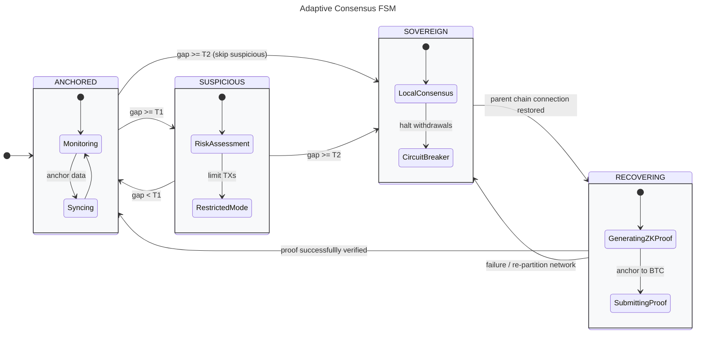

# Formal Specification of Engram FSM (Draft)

This directory contains the formal mathematical specification of the **Adaptive Consensus FSM (Finite State Machine)** for the Engram Protocol network. The model is written in **TLA+** to verify the correctness of the system design under network partition scenarios.

## Layer 1: Abstract FSM Layer (Core Model)

### 1. Engram FSM System Overview

The FSM governs Engram's consensus across four core states:
* **ANCHORED:** Normal operation; securely anchored to Bitcoin via Babylon.
* **SUSPICIOUS:** Restricts high-risk and prioritizes important transactions.
* **SOVEREIGN:** Disconnect Bitcoin Blockchain, activates Local PoS for liveness and triggers the Circuit Breaker.
* **RECOVERING:** Connectivity restored; aggregates Sovereign state transitions into a single ZK-Proof to re-anchor to Bitcoin.


#### Bitcoin Finality Gap ($\Delta H_{\text{BTC}}$)

Referring to the monitoring formula and Liveness Attack assessment of the Bitcoin network from the [Vigilante Checkpointing Monitor](https://docs.babylonlabs.io/guides/overview/babylon_genesis/architecture/vigilantes/monitor/), the formula is simplified for the Finality Gap Sensor as follows:

$$ \Delta H_\text{BTC} = H_\text{current} - \min\left(H_\text{submitted}, H_\text{anchored}\right) $$

* **$H_\text{current}$**: The current block height of the Bitcoin network as observed by Engram nodes.
* **$H_\text{submitted}$**: The Bitcoin block height at the exact moment an Engram epoch ends and its checkpoint is submitted.
* **$H_\text{anchored}$**: The Bitcoin block height at which the Engram checkpoint is successfully included.

**Proposed Threshold Design (Based on 10-minute BTC blocks):**
- **Epoch Length:** 1 BTC block (~10 minutes). Engram batches all its 2-second blocks into one checkpoint per Bitcoin block.
- **$T_1$ (Suspicious Threshold):** 6 to 12 BTC blocks (~1 to 2 hours). If the gap reaches 6-12 blocks, it clearly indicates mempool congestion or submission delays, triggering Restricted Mode.
- **$T_2$ (Sovereign Threshold):** 24 to 36 BTC blocks (~4 to 6 hours). A prolonged gap of 24+ blocks means a severe outage or network partition, safely triggering the Sovereign fallback.

#### Data Availability Gap ($\Delta H_\text{DA}$)

$$ \Delta H_\text{DA} = H_\text{local} - H_\text{verified} $$

- $H_\text{local}$: The current block height of the Engram network.  
- $H_\text{verified}$: The highest Engram block height that has received a valid Data Availability (DA) receipt from Celestia via Blobstream.

#### Data Availability Sampling

Let $s_i \in \{\text{TRUE}, \text{FALSE}\}$ denote the outcome of the $i$-th data availability sample.

- **Data Availability Condition:**

$$ \text{IsAvailable}(B) \triangleq \bigwedge_{i=1}^{N} s_i $$

- **Failure Condition:**

$$ \text{Failed}(B) \triangleq \exists i \in \{1, \dots, N\} \text{ such that } \neg s_i $$

To prevent Data Withholding and Long-Range attacks, Engram validator nodes must perform two actions: **Check DA Commitment** and **Data Availability Sampling (DAS)** (taking 15 samples to ensure 99% of a block's data is published). DA commitment serves as a certificate check, while DAS is the act of manually verifying the data availability to guarantee absolute security.

We consider three scenarios of connection loss:
1.  **Case 1:** Loss of connection to the Data Availability layer (Celestia) only.
2.  **Case 2:** Loss of connection to the Security/Settlement layer (Bitcoin) only.
3.  **Case 3:** Simultaneous loss of connection to both the Data Availability and Security/Settlement layers.

To prevent Eclipse Attacks, every node in the P2P network must establish a minimum number of peers.

### State Transitions

> **IMPORTANT NOTE:** All state transitions must achieve consensus from > 2/3 of the nodes in the network.

* **ANCHORED TO SUSPICIOUS:** This transition occurs if the Bitcoin gap exceeds $T_1$, the DA gap exceeds $T_\text{DA}$, or a failed sampling event exists:

  $$
  \begin{aligned}
  \text{AnchoredToSuspicious} \triangleq \space & state = \text{Anchored} \\
  & \land \left( (\Delta H_\text{BTC} \geq T_1) \lor (\Delta H_\text{DA} > T_\text{DA}) \lor \left(\exists i \in \{1, \dots, N\} : \neg s_i\right) \right)
  \end{aligned}
  $$

* **SUSPICIOUS TO SOVEREIGN:** This transition occurs if the state is Suspicious and the Bitcoin gap exceeds $T_2$:

  $$
  \begin{aligned}
  \text{SuspiciousToSovereign} \triangleq \space & state = \text{Suspicious} \\
  & \land (\Delta H_\text{BTC} > T_2)
  \end{aligned}
  $$

* **SOVEREIGN TO RECOVERING:** This transition occurs when the gaps fall below their thresholds or data sampling is completely successful:

  $$
  \begin{aligned}
  \text{SovereignToRecovering} \triangleq \space & state = \text{Sovereign} \\
  & \land \left( (\Delta H_\text{BTC} < T_1) \lor (\Delta H_\text{DA} \leq T_\text{DA}) \lor \left(\forall i \in \{1, \dots, N\} : s_i\right) \right)
  \end{aligned}
  $$

* **RECOVERING TO ANCHORED:** This transition occurs under the same recovery conditions, provided the ZK-Proof is successfully verified:

  $$
  \begin{aligned}
  \text{RecoveringToAnchored} \triangleq \space & state = \text{Recovering} \\
  & \land \left( (\Delta H_\text{BTC} < T_1) \lor (\Delta H_\text{DA} \leq T_\text{DA}) \lor \left(\forall i \in \{1, \dots, N\} : s_i\right) \right) \\
  & \land (\text{Verify\_ZK\_Proof} = \text{TRUE})
  \end{aligned}
  $$


#### State Machine Diagram



### 1. Executive Summary
A formal verification report on the Engram Protocol's Adaptive Consensus Finite State Machine (FSM). It proves that the "Circuit Breaker" mechanism successfully mitigates Data Availability (DA) and Bitcoin Settlement Layer outages without violating safety or liveness properties.

### 2. Formal System Parameters & Constraints
The FSM is modeled with bounded constants to ensure exhaustive state-space exploration by the TLC Model Checker:
*   `T_SUSPICIOUS = 2`: Threshold for network latency warning.
*   `T_SOVEREIGN = 5`: Threshold for triggering the Local PoS fallback.
*   `MAX_BTC_GAP = 7` / `MAX_DA_GAP = 8`: Upper bounds simulating extreme network partitions.
*   `HYSTERESIS_WAIT = 3`: Delay buffer to prevent state flapping during recovery.

### 3. State Machine & Type Invariants
The core protocol transitions between four deterministic states: `{"ANCHORED", "SUSPICIOUS", "SOVEREIGN", "RECOVERING"}`. 
The system is protected by strict type invariants ensuring variables (`btc_gap`, `da_gap`, `peer_count`) never breach their bounded domains.

### 4. Verified Temporal & Safety Properties
The TLC Model Checker verified millions of states with **zero errors**, confirming the following core axioms:

**Safety Guarantees (Bad things never happen):**
*   **Safety 1 (Circuit Breaker):** `withdraw_locked <=> (state \in {"SOVEREIGN", "RECOVERING"})`. The protocol never permits unsafe withdrawals during a fallback.
*   **Safety 2 (Deadlock-Freedom):** `[]ENABLED Next`. The FSM never enters a halted or deadlocked state; a valid state transition is always mathematically available.
*   **Safety 3 (Hysteresis & Transition Validity):** The protocol prevents premature re-anchoring. A transition from `RECOVERING` back to `ANCHORED` strictly requires `safe_blocks = HYSTERESIS_WAIT` and `reanchoring_proof_valid = TRUE`.

**Liveness Guarantees (Good things eventually happen):**
*   **Liveness 1 (Fault Isolation):** `IsCriticalCondition ~> (state = "SOVEREIGN" \/ ~IsCriticalCondition)`. The system guarantees an immediate transition to self-sovereignty if critical faults persist.
*   **Liveness 2 (Recovery Attempt):** `(state = "SOVEREIGN" /\ IsHealthyCondition) ~> (state = "RECOVERING" \/ ~IsHealthyCondition)`. The protocol always initiates a recovery sequence when the network stabilizes.
*   **Liveness 3 (Complete Re-anchoring):** `(state = "RECOVERING" /\ reanchoring_proof_valid /\ IsHealthyCondition) ~> (state = "ANCHORED" \/ ~IsHealthyCondition)`. The system strictly guarantees a successful return to the fully anchored state once the recovery proof is validated and the environment remains healthy.


### Execution result
```
cuongct090_04@MacBook-Air-cua-Cuong-CT spec % tlc -config EngramFSM.cfg EngramFSM.tla
........
Starting... (2026-04-13 15:36:16)
Implied-temporal checking--satisfiability problem has 3 branches.
Computing initial states...
Finished computing initial states: 1 distinct state generated at 2026-04-13 15:36:16.
Checking 3 branches of temporal properties for the current state space with 6228 total distinct states at (2026-04-13 15:36:19)
Finished checking temporal properties in 00s at 2026-04-13 15:36:19
Progress(3) at 2026-04-13 15:36:19: 169,523 states generated (169,523 s/min), 2,076 distinct states found (2,076 ds/min), 1,991 states left on queue.
Checking 3 branches of temporal properties for the current state space with 14364 total distinct states at (2026-04-13 15:37:19)
Finished checking temporal properties in 04s at 2026-04-13 15:37:24
Progress(4) at 2026-04-13 15:37:24: 4,990,879 states generated (4,821,356 s/min), 4,788 distinct states found (2,712 ds/min), 2,313 states left on queue.
Checking 3 branches of temporal properties for the current state space with 18384 total distinct states at (2026-04-13 15:38:24)
Finished checking temporal properties in 08s at 2026-04-13 15:38:33
Progress(5) at 2026-04-13 15:38:33: 11,420,801 states generated (6,429,922 s/min), 6,128 distinct states found (1,340 ds/min), 464 states left on queue.
Checking 3 branches of temporal properties for the current state space with 24432 total distinct states at (2026-04-13 15:39:33)
Finished checking temporal properties in 12s at 2026-04-13 15:39:46
Progress(6) at 2026-04-13 15:39:46: 16,103,382 states generated (4,682,581 s/min), 8,144 distinct states found (2,016 ds/min), 159 states left on queue.
Checking 3 branches of temporal properties for the current state space with 36402 total distinct states at (2026-04-13 15:40:46)
Finished checking temporal properties in 18s at 2026-04-13 15:41:04
Progress(8) at 2026-04-13 15:41:04: 20,408,781 states generated (4,305,399 s/min), 12,134 distinct states found (3,990 ds/min), 2,015 states left on queue.
Progress(8) at 2026-04-13 15:42:04: 24,359,321 states generated (3,950,540 s/min), 12,176 distinct states found (42 ds/min), 100 states left on queue.
Progress(9) at 2026-04-13 15:43:03: 28,467,199 states generated, 14,112 distinct states found, 0 states left on queue.
Checking 3 branches of temporal properties for the complete state space with 42336 total distinct states at (2026-04-13 15:43:03)
Finished checking temporal properties in 25s at 2026-04-13 15:43:29
Model checking completed. No error has been found.
  Estimates of the probability that TLC did not check all reachable states
  because two distinct states had the same fingerprint:
  calculated (optimistic):  val = 2.2E-8
  based on the actual fingerprints:  val = 2.5E-14
28467199 states generated, 14112 distinct states found, 0 states left on queue.
The depth of the complete state graph search is 9.
The average outdegree of the complete state graph is 0 (minimum is 0, the maximum 31 and the 95th percentile is 1).
Finished in 07min 13s at (2026-04-13 15:43:29)
```


## How to Run Verification

To verify this model on macOS or Linux, ensure you have Java installed.

### Prerequisites
1. Install Java (JDK 11 or higher).
2. Download `tla2tools.jar` from the [TLA+ Releases page](https://github.com/tlaplus/tlaplus/releases).

### Using Command Line (CLI)
Navigate to the `docs/spec` directory and run the TLC Model Checker using the downloaded jar file. Replace `/path/to/tla2tools.jar` with the actual location of your jar.

Verify the main FSM:
```bash
java -cp /path/to/tla2tools.jar tlc2.TLC -config EngramFSM.cfg EngramFSM.tla
```

Verify Safety specifically:
```bash
java -cp /path/to/tla2tools.jar tlc2.TLC -config MC_Safety.cfg MC_Safety.tla
```

Verify Liveness specifically:
```bash
java -cp /path/to/tla2tools.jar tlc2.TLC -config MC_Liveness.cfg MC_Liveness.tla
```

### Using VS Code
If you have the TLA+ extension installed in VS Code, you can run checks without downloading the jar manually:
1. Open the `.tla` file (e.g., `MC_Safety.tla`).
2. Open the Command Palette (`Cmd+Shift+P` on macOS, `Ctrl+Shift+P` on Linux).
3. Select `TLA+: Check model with TLC`.